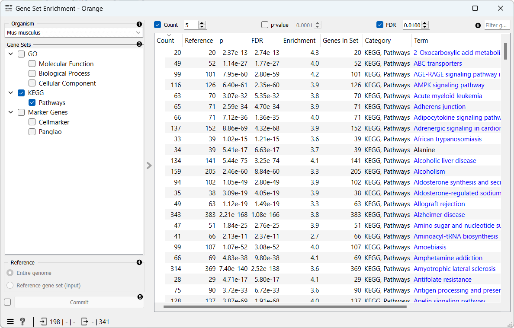
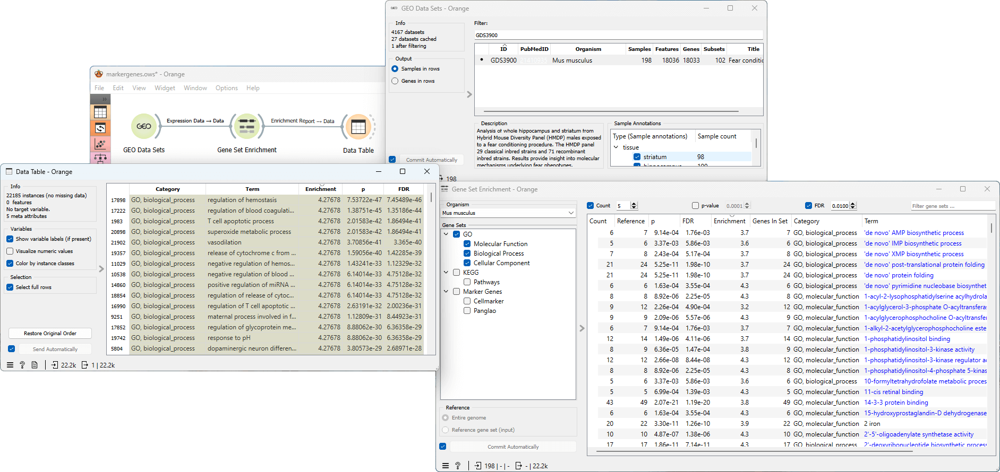

Gene Set Enrichment
===================

Enrich gene sets.

**Inputs**
- Data: Data set.
- Custom Gene Sets: Genes to compare.
- Reference Genes: Genes used as reference.

**Outputs**

- Matched Genes: Genes that match.

[Gene Set Enrichment Analysis](https://en.wikipedia.org/wiki/Gene_set_enrichment_analysis) (GSEA) is a method to find gene sets overrepresented in a large group of genes, possibly associated with different phenotypes. For each gene set in the given set of gene sets, the widget calculates the enrichment using the [hypergeometric test](https://en.wikipedia.org/wiki/Hypergeometric_distribution#Hypergeometric_test) which determines the probability of observing the overlap between the genes in the gene set and the input genes by chance, given the total number of genes in the genome and the number of genes in the gene set.

1. Select the *Organism*.
2. *Gene Sets*: A list of available gene sets that can be selected for enrichment analysis. Select multiple gene sets by ticking the checkbox next to the gene set name.
3. *Reference*: Select whether to use the entire genome or only the genes in the input data as reference.
4. If *Commit Automatically* is ticked, results will be automatically sent to the output. Alternatively, press *Commit*.
5. Filter the results by limiting the number of mapped genes and setting thresholds for p-value and FDR.

Example
-------

From **GEO Data Sets** widget we select the [GDS3900](https://pubmed.ncbi.nlm.nih.gov/21410935/) data set *Fear conditioning effect on hybrid mouse diversity panel*. The analysis focuses on the whole hippocampus and striatum from Hybrid Mouse Diversity Panel (HMDP) males exposed to a fear conditioning procedure. Next, we feed this data into the **Gene Set Enrichment** widget, where we specify *Mus musculus* as the *Organism* and select the Gene Ontology gene sets. After filtering the results, we proceed to connect the widget to the **Data Table** to inspect the *Enrichment report*.

